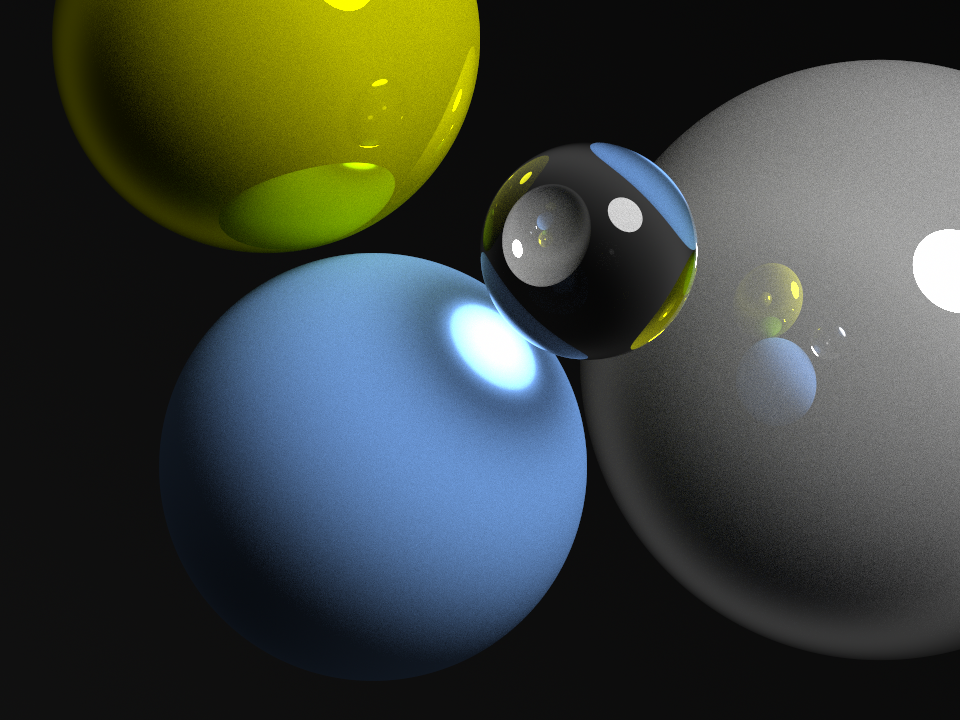

# Photon

Photon is a Java ray tracing (or path tracing) library that could be 
used to produce realistic 3D images. I started writing this library 
to exercise the concepts learned from the [Ray Tracing in One 
Weekend](https://raytracing.github.io) book series. It is still so
much a work in progress.

Examples of images generated by this library could be found 
[here](./images). This is one such example:

The above example was generated using this (or a close variant of it) 
[example](./src/test/java/io/github/ghadeeras/photon/examples/Globes.java)

So far, little effort has been done to improve its performance. The
focus currently is on having a clean design, and to grasp the concepts
gleaned from the aforementioned book.